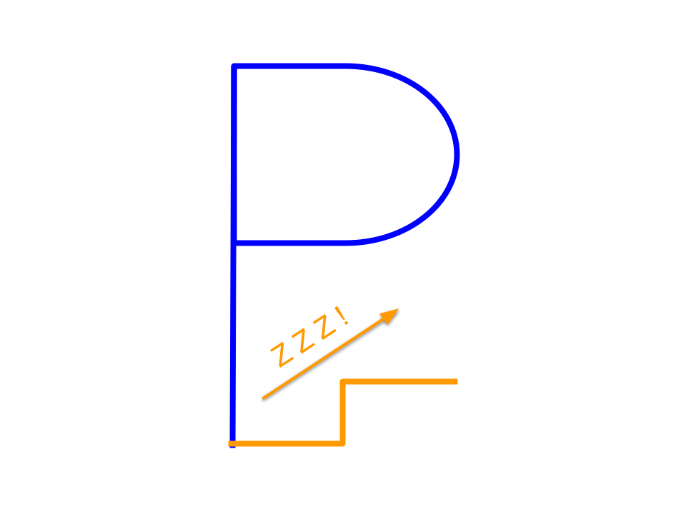

# Eye Saver for macOS

A simple macOS application to remind you to take breaks and rest your eyes.



## Description

Eye Saver is a minimalist timer application for macOS. It helps you manage your screen time and reminds you to take regular breaks, preventing eye strain and fatigue. The app features a clean interface where you can set a countdown timer. When the time is up, it plays a sound to notify you.

## Features

-   **Simple and Clean UI:** A minimalist interface that is easy to use.
-   **Customizable Timer:** Set the countdown timer to any duration you want.
-   **Sound Notification:** Plays a sound to notify you when the time is up.
-   **Configurable:** The application can be configured through a `setup.json` file.

## Installation

To run this application, you need to have Python and `pygame` installed.

1.  **Clone the repository:**
    ```bash
    git clone https://github.com/Phil-Liao/Eye_Saver_MacOS.git
    ```
2.  **Install the dependencies:**
    ```bash
    pip install -r requirements.txt
    ```
3.  **Run the application:**
    ```bash
    python main.py
    ```

## How to Use

1.  Enter the desired countdown time in minutes in the input box.
2.  Click the "Start" button to begin the countdown.
3.  The application will display the remaining time.
4.  When the time is up, a sound will be played.

## Configuration

The application can be configured by editing the `setup.json` file. Here are the available options:

| Key                      | Description                                  |
| ------------------------ | -------------------------------------------- |
| `WIDTH`                  | The width of the application window.         |
| `HEIGHT`                 | The height of the application window.        |
| `SCREEN_CAPTION`         | The caption of the application window.       |
| `FPS`                    | The frames per second of the application.    |
| `BG_COLOR`               | The background color of the application.     |
| `TEXT_PASSIVE_COLOR`     | The color of the text.                       |
| `TEXT_ACTIVE_COLOR`      | The color of the text when it is active.     |
| `PASSIVE_COLOR`          | The color of the UI elements.                |
| `ACTIVE_COLOR`           | The color of the UI elements when they are active. |
| `TIMES_UP_SOUND`         | The path to the sound file to be played.     |
| `BG_STARTUP_TEXT`        | The text displayed on the main screen.       |
| `BG_TIME_UP_TEXT`        | The text displayed when the time is up.      |
| `CONTROL_BOX_STARTUP_TEXT` | The text displayed on the control button.    |
| `CONTROL_BOX_TEXT`       | The text displayed on the control button.    |
| `INPUT_BOX_STARTUP_TEXT` | The text displayed in the input box.         |

## License

This project is licensed under the MIT License - see the [LICENSE.md](LICENSE.md) file for details.
